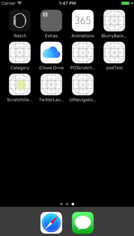

# ScratchView
简单封装刮奖效果



使用说明
======
###安装
#####手工导入
将项目目录下的`ScratchView`导入项目中

###使用
1. 导入头文件
		
	```objective-c
	#import "SIScratchView.h"
	```
	
2. 添加需要遮挡的View

	```objective-c
	UIImageView *imageView = [[UIImageView alloc]initWithFrame:CGRectMake(75,100, 150, 250) ];
    imageView.contentMode = UIViewContentModeScaleAspectFill ;
    imageView.image = [UIImage imageNamed:@"1"] ;
    imageView.clipsToBounds = YES ;
    [self.view addSubview:imageView] ;
	```
	
3. 设置遮罩层View

    ```objective-c
    //自定义覆盖view
    UIView *coverView = [[UIView alloc] initWithFrame:CGRectMake(0, 0, 150, 250)];
    coverView.backgroundColor = [UIColor greenColor];
	```
	
4. 初始化ScratchView并添加遮罩层

	```objective-c
	// 初始化
	- (SIScratchView *)scratchView {
   	 	if (_scratchView == nil) {
        	_scratchView = [[SIScratchView alloc] initWithFrame:CGRectMake(75, 100, 150, 250)];
        	_scratchView.maxPathCount = 30;
        	_scratchView.pathWidth = 50.0;
        	_scratchView.pathCount = 6 ;
        	_scratchView.scratchViewDelegate = self ;
    	}
    	return _scratchView;
	}
	
	// 添加
    [self.scratchView setCoveredView:coverView];
    [self.view addSubview:self.scratchView];
	```
	
	其中属性的含义如下:

		/// 路径的宽度
		@property (nonatomic,assign) CGFloat pathWidth ;

		/// 行以及列的路径数,如果设置为3总共会分成3*3个块
		@property (nonatomic,assign) NSUInteger pathCount ;

		/// 最大路径数,经过多少块自动消失
		@property (nonatomic,assign) NSUInteger maxPathCount ;

		/// 被覆盖的View
		@property (nonatomic,strong) UIView *coveredView ;

		/// 代理
		@property (nonatomic,weak) id<SIScratchViewDelegate>scratchViewDelegate ;
		
5. 实现代理方法

	```objective-c
	#pragma mark --- SIScratchViewDelegate
	- (void)scratchViewDidOpen:(SIScratchView *)scratchView{
    	NSLog(@"%s",__func__) ;
	}

	```
	
##ScratchView
ScratchView is available under the MIT license. See the LICENSE file for more info.
	
